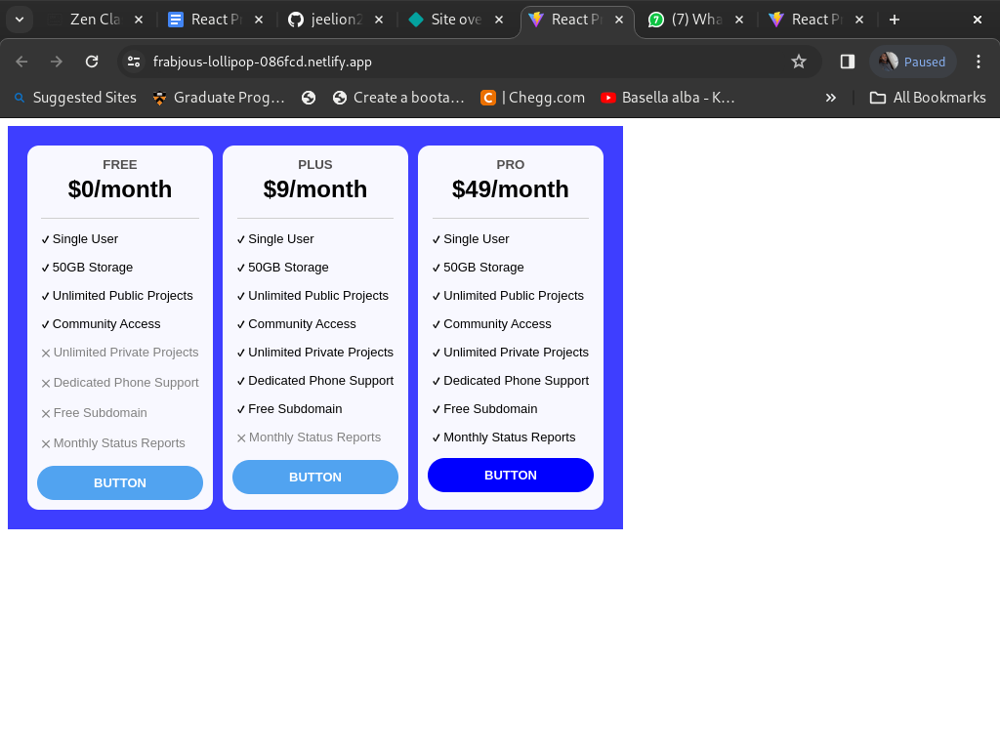
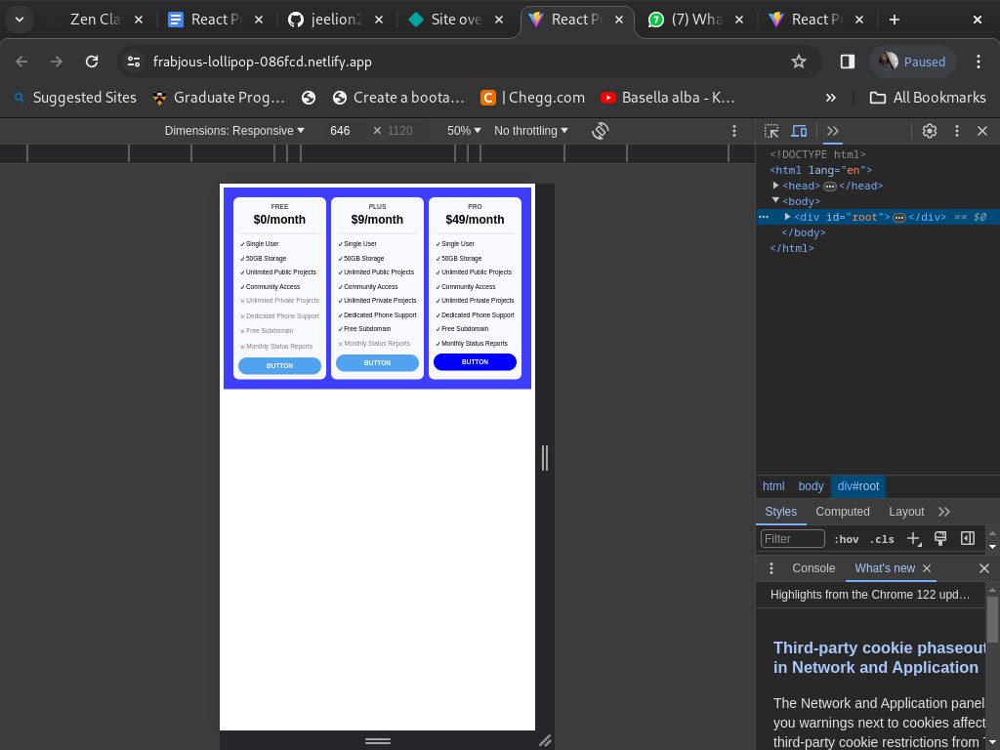
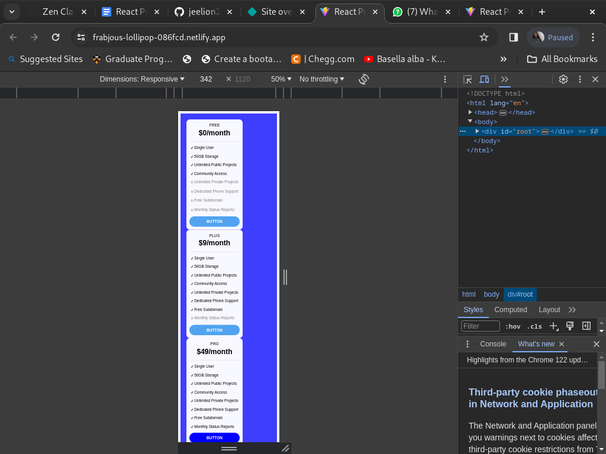
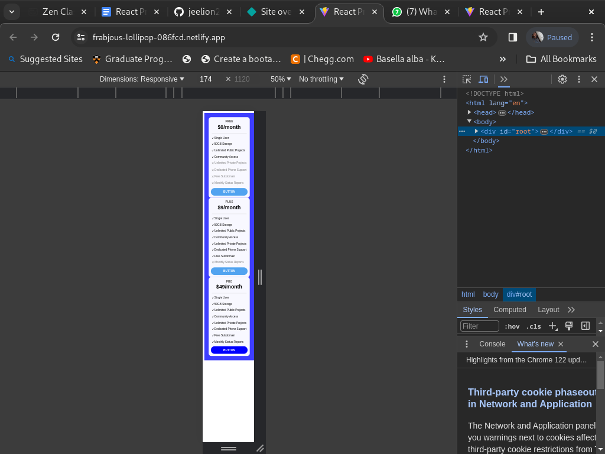

# React Price Card

This is the app created for showing price cards for a subscription by using React frame work.

## Table of Contents

- [Introduction](#introduction)
- [Project Images](#Images)
- [Installation](#installation)
- [Usage](#usage)
- [License](#license)

## Introduction

In this web application, you can see the subscription plans for some services. It only contains how the cards are designed but none of what to subscribe. The React framework is used to design the page. 

[Netlify link](https://frabjous-lollipop-086fcd.netlify.app/)

## Images

The below images tell about how the homepage looks like and shows its responsivenes

## Installation

No installation is required except a latest web browser.

## Usage

It can be used as reference for how a price card to be designed(individuals preference may vary).

## License

MIT License

---